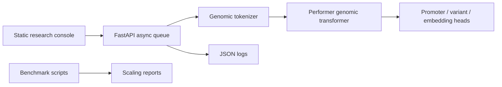
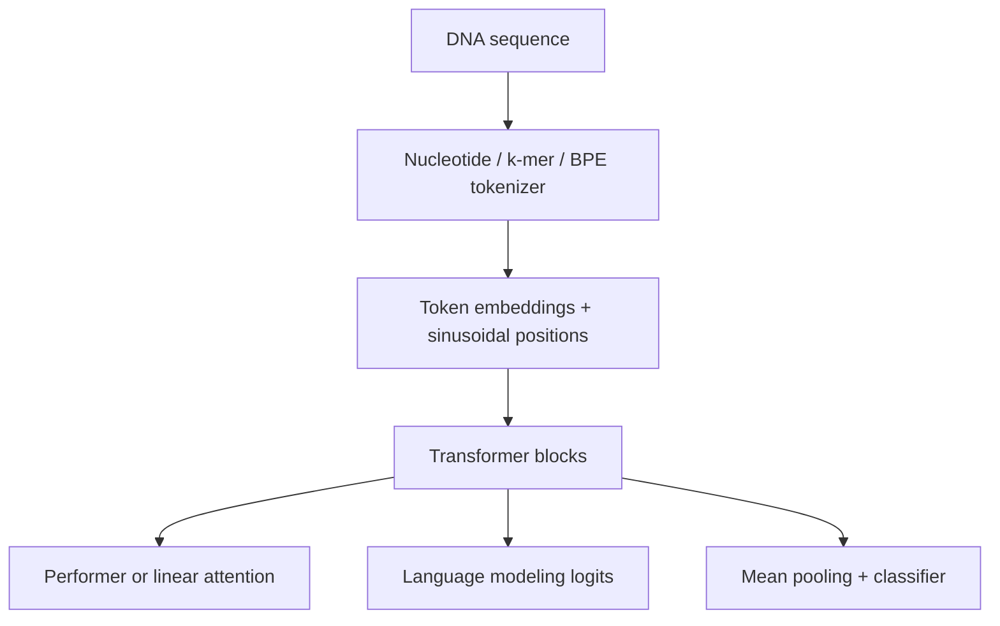
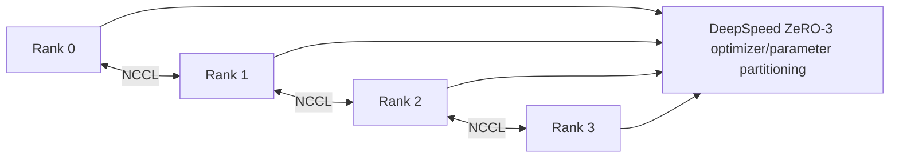

# Architecture

## System Flow

## Model Pipeline

The transformer path is intentionally compact so it can run in CI and on laptops. The same
interfaces are designed for larger hidden sizes, more layers, and GPU acceleration.

## Kernel Acceleration Hooks

- `hogfm.kernels.linear_attention` is the portable PyTorch correctness path.
- `hogfm.kernels.flash_attention` wraps FlashAttention for exact attention baselines on GPU.
- `hogfm.kernels.triton_ops` provides a fused ELU+1 feature-map kernel for CUDA tensors.

These modules fail loudly when optional GPU dependencies are absent, which keeps CPU development
honest while preserving a clear path for hardware-specific experiments.

## Distributed Topology

The repository includes `configs/deepspeed_zero3.json` for large-model experiments. The local
training loop is deliberately dependency-light; the DeepSpeed entry point remains available for
multi-GPU extension.

## Serving Layer

The API owns a bounded async queue. Endpoints enqueue work and a background worker performs model
execution in a thread so long-running sequence calls do not block the ASGI event loop.

## Observability

Application logs are emitted as JSON. Request path, method, latency, and status code are attached
with stable keys for ingestion by Loki, CloudWatch, or managed OpenTelemetry collectors.
